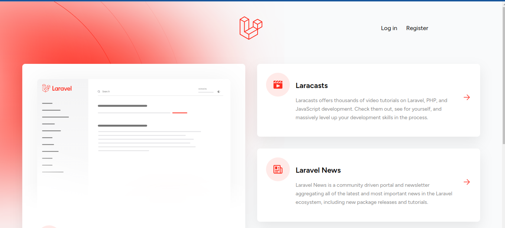
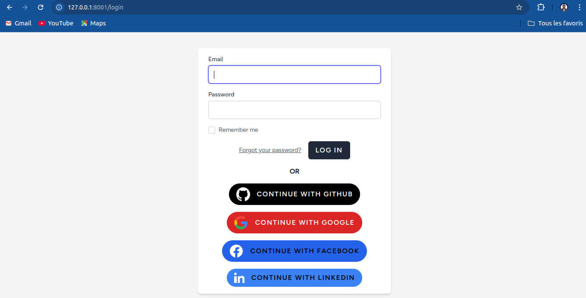
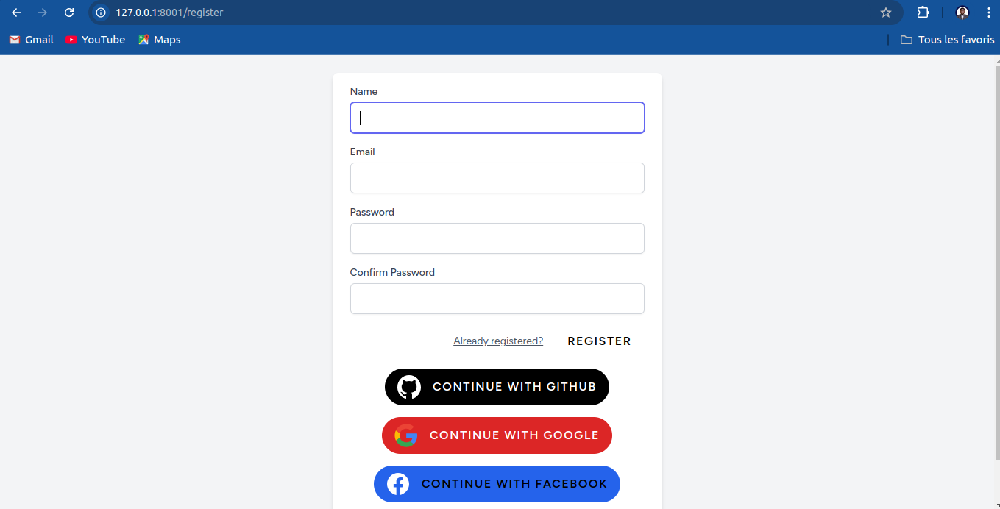

# OAuth Login/Password
It's about to develop a complete module for registration, login, profile management and user lists with different types of authentication.





# Getting Started


## INSTALLATION

1. Clone the repository:
   ```bash
   git clone https://github.com/Brandon22030/OAuth-login-password.git
   ```

<br>

# Usage


# 1. Installation of dependencies

### 1. Install laravel dependencies
   ```bash
   composer install
   ```

### 2. Run laravel server
   ```bash
   php artisan serve --port=8001
   ```

### 3. Install vuejs dependecies
   ```bash
   npm install
   ```

### 3. Run vuejs server
   ```bash
   npm run dev
   ```
**check your website on http://127.0.0.1:8001**
